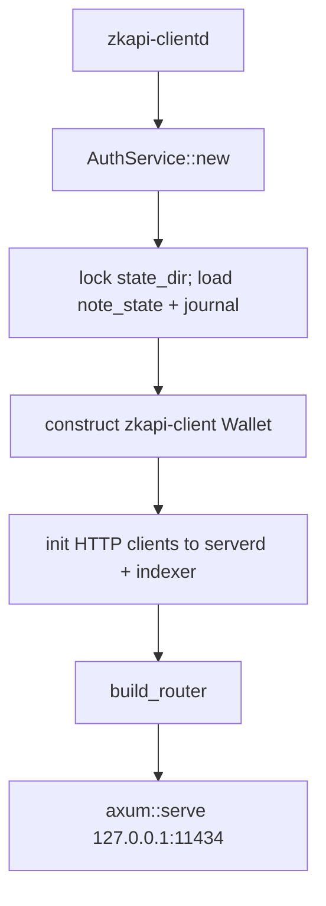
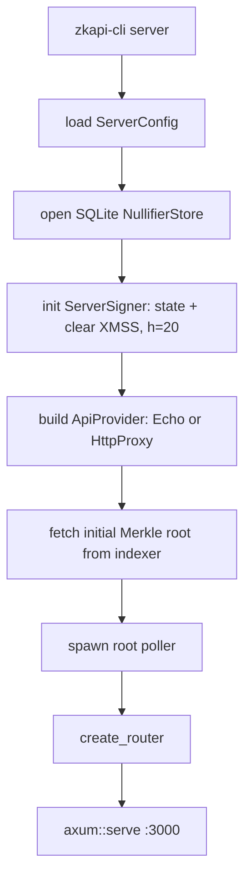
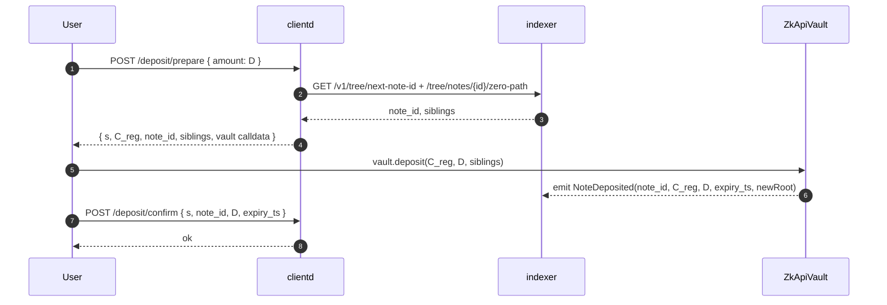
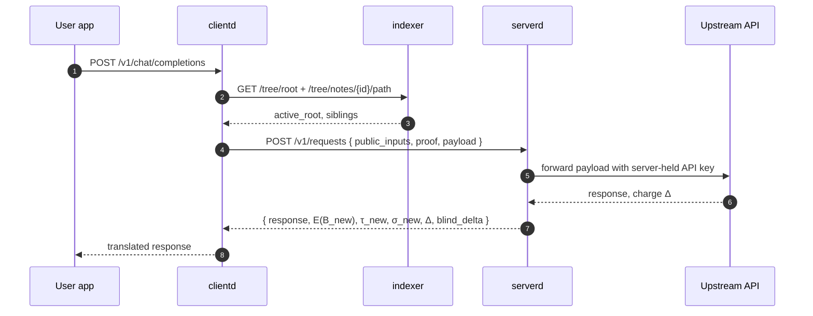
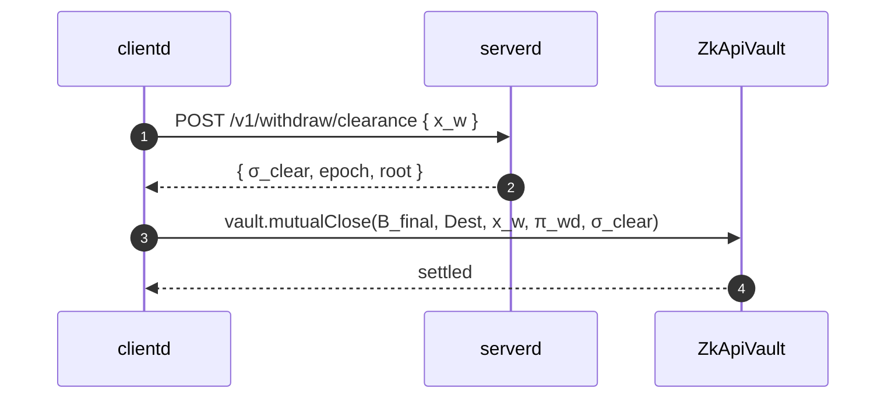

zkAPI ships two daemons that wire the simplified-nullifier protocol into a
drop-in OpenAI-compatible proxy. All crypto primitives live in the
[`curryrasul/zkAPI`](https://github.com/curryrasul/zkAPI) submodule. The
operational layer is **orchestration, not crypto**.

## Repository layout

```
cairo/          - ZK proof programs (request + withdrawal)
contracts/      - Solidity settlement contract (ZkApiVault)
rust/           - Off-chain Rust implementation
  crates/
    zkapi-types     - Shared types, serialization, domain constants
    zkapi-core      - Poseidon hash, Merkle tree, nullifier, leaf helpers
    zkapi-crypto    - Pedersen commitment, XMSS/WOTS+ signatures
    zkapi-proof     - Proof generation/verification orchestration
    zkapi-client    - Client wallet, note lifecycle, recovery
    zkapi-serverd   - Server: proof verification, nullifier store, signing
    zkapi-indexerd  - Merkle tree mirror from on-chain events
    zkapi-cli       - Command-line interface
```

## `clientd` launch



Routes registered: LLM-compat (`/v1/chat/completions`, `/v1/responses`,
`/api/chat`), core (`POST /request`), wallet (`/status`, `/wallet/recover`),
deposit (`/deposit/{prepare,confirm}`), funding UI (`/funding`,
`/funding/api/*`).

## `serverd` launch



Routes registered: `/health`, `/v1/attestation`, `POST /v1/requests`,
`POST /v1/withdraw/clearance`, `GET /v1/requests/{id}`, `GET /v1/nullifiers/{x}`.

## Modularity

The auth craft on `clientd` and the auth check on `serverd` are each a single
trait. Swapping schemes is a trait swap, nothing else touches.

| Mode | clientd auth craft | serverd auth check |
|---|---|---|
| ZK (default) | build `x`, `E(B)_anon`, `π_req` | verify proof, spend nullifier, sign next state |
| User-supplied API key | inject `Authorization: Bearer …` | passthrough; `serverd` is a plain proxy |
| Future (RLN / ARC) | alternate credential scheme | alternate verifier |

The upstream-provider side of `serverd` is a separate `ApiProvider` trait with
two working impls — `EchoProvider` for tests, `HttpProxyProvider` for anything
speaking HTTP (Ollama, OpenAI, web search, Ethereum RPC). None of it touches
the crypto path.

## Deposit flow



## Authenticated request flow



## Mutual-close withdrawal


